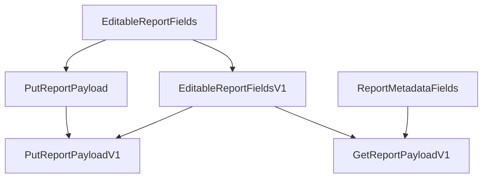

# Package com.terraformation.backend.report.api

Controllers and payload classes for the endpoints under `/api/v1/reports`.

## Payload class hierarchy

Since report formats can change over time, versioning is baked into the structure of the payload classes.

The basic goals:

* A GET payload should have a fixed set of metadata fields that don't vary across versions.
* A PUT payload should only include fields that clients are actually allowed to edit. These will vary from version to version.
* For a given report version, the PUT payload fields should have the same names and types as the corresponding GET payload fields (but the GET payload can contain additional read-only fields).
* A PUT payload should be able to write its values to a report model object of the latest version.



This hierarchy is just to keep things consistent and maintainable on the server side. Clients see payloads with version fields, e.g.,

```json
{
    "report": {
        "version": "1",
        "seedBanks": [
            { ... }
        ]
    }
}
```
